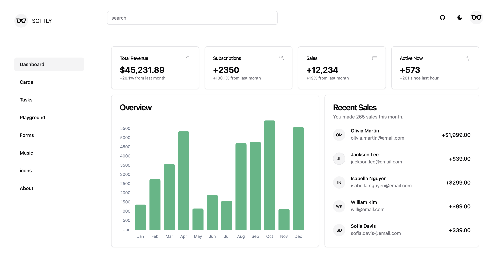
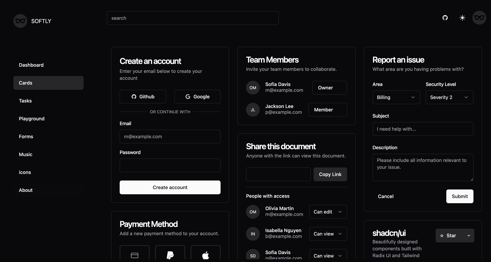
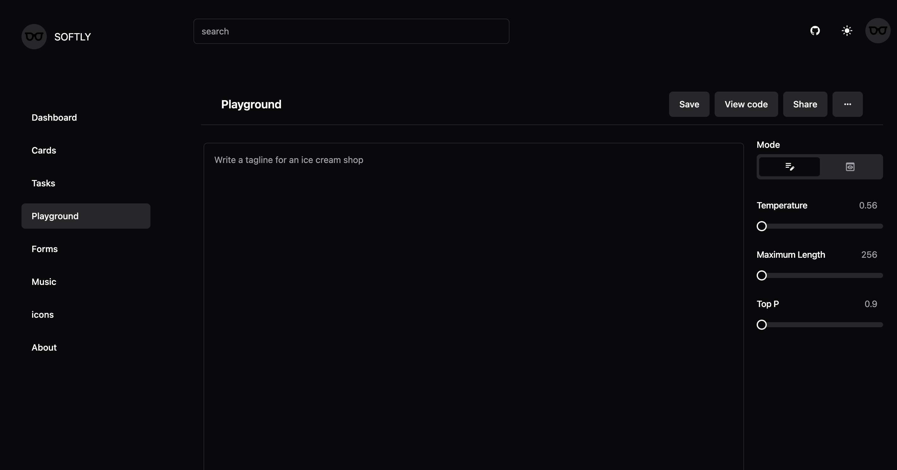

<h1 style="display: flex; align-items: center; justify-content: center;"> 
  
  <span>SOFTLY<span>
</h1>

[SOFTLY](https://github.com/shellingfordly/softly) is a light and softly web software of admin site. This project uses [Shadcn/UI](https://www.shadcn-vue.com/) to build a page. You have the flexibility to install the required components, and freely modify the component code, then customize the components to your needs.

This project is mainly for learning the implementation demo. The current page content and data are from [shadcn-vue](https://www.shadcn-vue.com/examples/dashboard.html).

## Document

[English](https://github.com/shellingfordly/softly/blob/main/README.md) | [中文](https://github.com/shellingfordly/softly/blob/main/README_CN.md)

[🖥 Online Preview](https://softly-two.vercel.app/)



## Setup

Make sure to install the dependencies:

```bash
pnpm install
```

## Development Server

Start the development server on `http://localhost:3000`:

```bash
pnpm run dev
```

## Production

Build the application for production:

```bash
pnpm run build
```

Locally preview production build:

```bash
pnpm run preview
```

## Preparation

- [Nuxt3](https://nuxt.com/)
- [shadcn-vue](https://www.shadcn-vue.com/)
- [vue3](https://github.com/vuejs/core)
- [vueuse](https://vueuse.org/)
- [tailwind css](https://github.com/tailwindlabs/tailwindcss)
- [iconify](https://iconify.design/)

## Preview

### dark mode

- dashboard


- cards



- tasks


- playground



- icons


