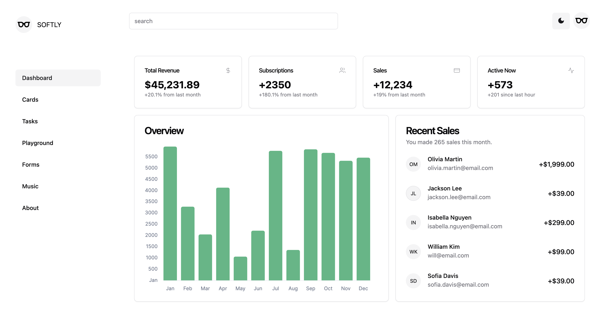
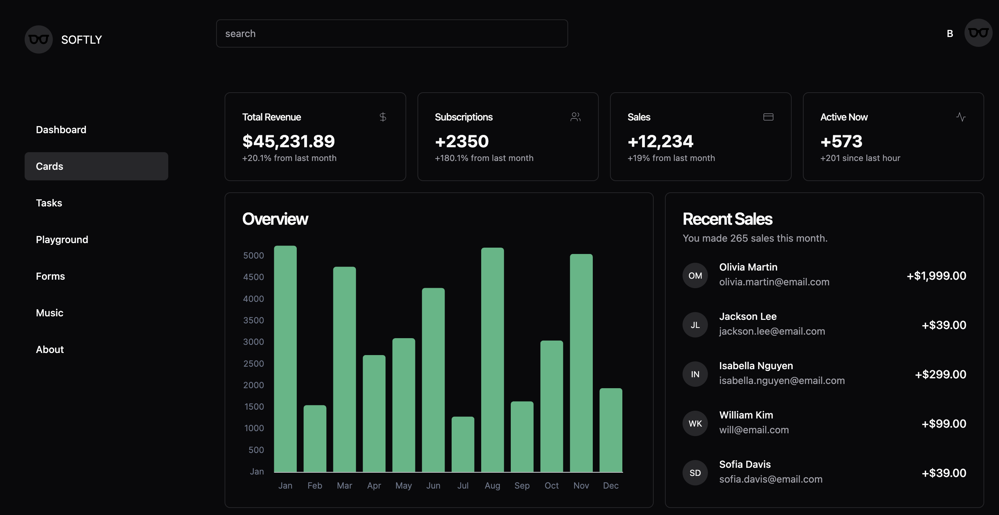
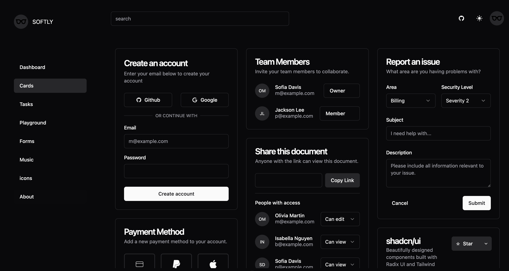
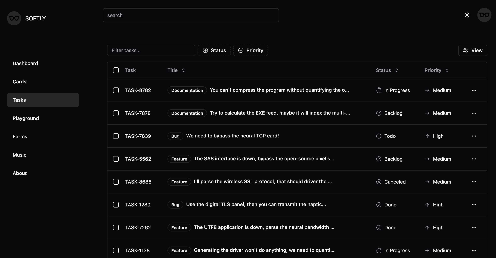

<h1 style="display: flex; align-items: center; justify-content: center;"> 
  
  <span>SOFTLY<span>
</h1>

[SOFTLY](https://github.com/shellingfordly/softly)是一个轻量、柔和的管理后台 web 应用。本项目使用[Shadcn/UI](https://www.shadcn-vue.com/)构建页面。您可以灵活地安装所需的组件，并自由地修改组件代码，然后根据需要定制组件。

本项目主要用于学习而实现的 Demo，目前页面内容和数据都来自[shadcn-vue](https://www.shadcn-vue.com/examples/dashboard.html).

## Document

[English](https://github.com/shellingfordly/softly/blob/main/README.md) | [中文](https://github.com/shellingfordly/softly/blob/main/README_CN.md)

[🖥 Online Preview](https://softly-two.vercel.app/)



## Setup

安装依赖

```bash
pnpm install
```

## Development Server

启动服务器 `http://localhost:3000`:

```bash
pnpm run dev
```

## Production

打包生产环境

```bash
pnpm run build
```

本地预览生产构建

```bash
pnpm run preview
```

## Preparation

- [Nuxt3](https://nuxt.com/)
- [shadcn-vue](https://www.shadcn-vue.com/)
- [vueuse](https://vueuse.org/)
- [iconify](https://iconify.design/)

## Preview

### dark mode

- dashboard



- cards



- tasks


